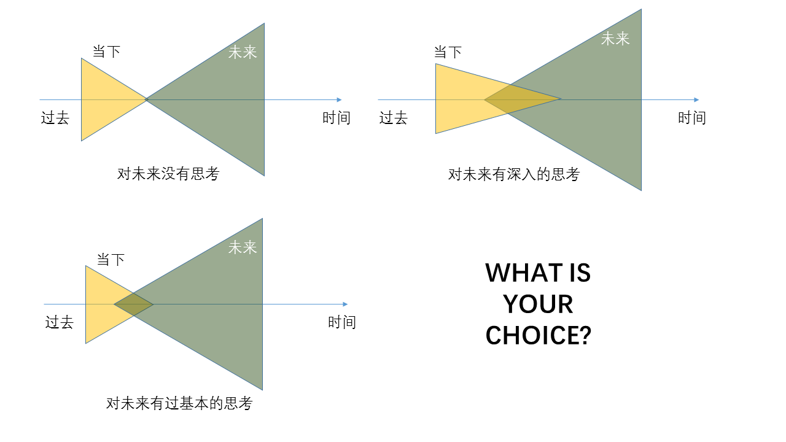

### 活在当下vs活在未来

作者|subond

日期|2016年04月12日

活在当下，这是一个正确的观念吗？当然是正确的。因为，无论何时，我们都只能从当下出发。这也是我自己在读《把时间当做朋友》的收获之一。而然，过分地追求当下的现实，往往把自己困在原地。

> “活在当下”，就是被永恒地困住；“活在过去”，那就相当于被永恒地困在更差的地方。

那么怎样才能活在未来呢？

> 1.你对未来有个预测；
> 2.那个预测需要时间才能得到结果；
> 3.你笃信你的预测是正确的；
> 4.于是你提前按照那个预测的结果行动、选择、思考；
> 5.你终将走到那个结果出现的时刻；
> 6.最终证明你的预测是正确的；
> 7.那么，由于你提前按未来正确的结果行动、选择、思考，于是，在相当长一段时间里，你的生活中的一部分，就是“活在未来”的。

虽然，只要少数人有预测未来的能力。但是，有些道理确是简单的，而很少有人去坚持和实践。就在今天，给自己列一个未来清单吧！坚持去做，一年后我们再来谈谈。

**那些未来的事**

1. 每周坚持跑步2次，每次8公里。身体素质就会越来越好，体型也是。
2. 坚持写作，文笔和思路就会有进步。
3. 多看些关于心理学，认知心理学，思维相关的书籍，跳出自己的框框。
